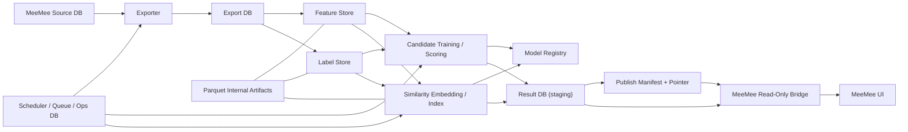

# ARCHITECTURE_EXTERNAL_ANALYSIS

## 目的

本ドキュメントでいう外付け解析・検証スタックの正式名称は `Tradex` とする。`Tradex` は Trade + CODEX による開発・検証基盤を指す。既存コードに残る `external_analysis` や `toredex` は当面の互換名である。

この文書は、MeeMee 本体と外付け解析基盤の責務境界を固定する。どのコンポーネントが何を持ち、どのデータストアを読み書きし、publish がどう原子的に切り替わり、MeeMee 本体が何だけを読むのかを明確化する。

ここで定義する構造は、後続の labeling、feature、roadmap 文書の土台である。設計上の最重要条件は、MeeMee 本体を重くしないこと、解析を別プロセス・別 DB に閉じ込めること、result DB only 契約を守ることである。

## 全体構成図

Parquet は internal artifacts であり、MeeMee 本体の読取り対象ではない。MeeMee 本体が参照してよいのは、result DB 内の `publish_pointer` テーブルと公開対象の result テーブルだけである。JSON pointer は採用しない。

## コンポーネント責務

MeeMee 本体は source DB の保持、通常の DB/UI/閲覧機能、read-only bridge による解析結果の表示、publish freshness と degrade 状態の表示、配布ユーザー向けの売買判定更新要求だけを行う。本体は Tradex 側の学習・検証・replay・walk-forward・重い再計算ジョブを起動しない。

固定文言として、MeeMee 本体は学習・検証・特徴量再構築・重い解析計算を行わない。MeeMee 本体は Parquet を直接参照しない。MeeMee 本体は feature store、label store、export DB、ops DB、model registry を読まない。MeeMee 本体は旧解析 worker を再起動しない。bridge は補完計算や代替推論を行わない。

Exporter は MeeMee source DB から必要なテーブルと列を差分抽出し、export DB へ正規化して保存する。source 側の不整合検出、watermark 記録、再計算トリガの起点管理も担当する。

Feature Store は日次要約特徴と時系列窓特徴を管理する。Label Store は rolling horizon ラベルと anchor window outcome を管理する。これらは外付け解析の内部責務であり、MeeMee 本体は直接参照しない。

Model Registry は candidate engine と similarity engine のモデル、評価結果、champion/challenger 状態、artifact 参照を管理する。Phase 1 では土台のみを持ち、以後の phase で活用範囲を広げる。

Scheduler / Queue / Ops DB はジョブ投入、実行状態、resource 制御、checkpoint、失敗隔離、heartbeat、publish 実行管理を担当する。

Result DB は MeeMee へ公開される唯一の解析結果ストアである。publish 成功済みの結果だけを保持し、MeeMee は latest successful publish に紐づく結果のみを読む。

Read-Only Bridge は MeeMee 本体側の薄い読取り層である。`publish_pointer` の 1 行を解決し、`publish_id` で result DB をフィルタし、freshness 判定と degrade 分岐を行って UI へ渡す。bridge が行ってよい処理は pointer 解決、publish_id フィルタ、freshness 判定、degrade 分岐のみである。ここに学習ロジック、補完計算、重い再計算、代替推論は置かない。

## 本体と外付けの境界

MeeMee 本体が書いてよいのは source DB と本体固有の通常データだけである。Tradex が書いてよいのは export DB、feature store、label store、model registry、ops DB、result DB、publish manifest、`publish_pointer` だけである。これらの重い生成物の既定保存先は `G:\Tradex` 配下とし、MeeMee の `C:` 側ユーザーデータへ混在させない。

MeeMee 本体は Tradex の内部 DB や Parquet を直接読むことを禁止する。逆に Tradex は MeeMee UI 層へ直接依存しない。両者の共有面は source DB の入力契約と result DB の出力契約に限定する。既存の `external_analysis` という内部名は、将来の段階移行までの互換名である。

MeeMee が読んでよいテーブルは `publish_pointer`, `publish_manifest`, `candidate_daily`, `state_eval_daily`, `similar_cases_daily`, `similar_case_paths`, `regime_daily` のみである。MeeMee が読んではいけない対象は `candidate_component_scores`, `publish_runs`, model registry, ops DB, feature store, label store, export DB, Parquet, external_analysis 内部メタである。

これにより、解析失敗時も MeeMee 本体の閲覧性と応答性は維持される。解析が停止しても、本体は stale 表示に落ちるだけで壊れない。

## データストア分離

source DB は MeeMee の正本である。export DB は source DB から解析向けに正規化した外付け側の複製であり、差分同期の境界となる。feature store と label store は解析内部の学習素材であり、Parquet と DuckDB を組み合わせた internal store とする。

model registry は version 管理と採用管理のための store であり、result DB とは分離する。result DB は MeeMee に公開する結果だけを持つ。ops DB は queue、job state、resource sample、checkpoint、publish run を持つ。

この分離により、source の更新、内部特徴の再構築、publish 失敗、モデル比較、MeeMee への公開が互いに独立する。

## publish/read-only フロー

publish/read-only フローは次の順序に固定する。

`stage build -> validation -> publish_manifest write -> publish_pointer atomic switch -> MeeMee bridge read`

stage build では、新しい `publish_id` に対応する staging 結果を result DB 側へ用意する。validation では、必須テーブルの存在、schema version、一貫した `as_of_date`、row count、manifest 内容を検証する。publish_manifest write で当該 publish の内容を保存し、その後に `publish_pointer` を原子的に更新する。

MeeMee は `publish_pointer` 更新後の publish だけを読む。staging 中の結果や validation 未通過の結果は読まない。staging publish と failed publish は pointer 更新前のため不可視である。

`publish_pointer` は result DB 内の単一テーブルであり、最小列は `pointer_name`, `publish_id`, `as_of_date`, `published_at`, `schema_version`, `contract_version`, `freshness_state` とする。MeeMee はこのテーブルの 1 行だけを起点に読む。

## runtime/job 構成

runtime は別プロセスの orchestrator と複数 worker で構成する。少なくとも `export_sync`, `feature_build`, `label_build`, `anchor_window_build`, `publish_result` は独立ジョブとする。後続 phase で `candidate_train`, `candidate_score`, `similarity_embed`, `similarity_index_build`, `nightly_eval`, `registry_promote` を追加する。

各ジョブは `job_id`, `job_type`, `input_snapshot_id`, `as_of_date`, `checkpoint_uri`, `status`, `attempt`, `started_at`, `finished_at`, `error_class` を持つ。長時間ジョブは checkpoint 必須とし、中断再開可能にする。

Phase 1 では state evaluation の実データ生成を扱わないが、result DB schema 上の空テーブルは先に固定しておく。

## resource isolation

external_analysis は low priority を既定とする。MeeMee 前面利用時に重い学習や索引再構築を動かさない。アイドル時や夜間に重処理を回し、CPU/GPU 上限、温度、負荷閾値による pause/resume を実装する余地を残す。

本体と外付けのログは分離する。MeeMee 本体へ解析ログを混ぜない。resource 制御、job log、heartbeat は ops DB と external_analysis のログディレクトリで管理する。

## graceful degrade

latest successful publish が存在しない場合、MeeMee は解析パネルに「外付け解析結果は未公開」を表示し、候補一覧、類似事例、state evaluation を表示しない。CTA は抑制し、通常の DB/UI/閲覧機能は継続する。

warning stale の場合、MeeMee は最後の successful publish に紐づく候補一覧、類似事例、state evaluation を表示継続してよいが、「解析結果は最新ではありません」を表示し、CTA は抑制する。通常機能は継続する。

hard stale の場合、MeeMee は最後の successful publish に紐づく候補一覧と類似事例の表示継続を許容するが、state evaluation は表示しない。「解析結果が古いため参考表示に切替中」を表示し、CTA は抑制する。通常機能は継続する。

pointer corruption の場合、MeeMee は候補一覧、類似事例、state evaluation を表示しない。「解析結果ポインタが破損しています」を表示し、CTA は抑制する。通常機能は継続する。

manifest mismatch の場合、MeeMee は候補一覧、類似事例、state evaluation を表示しない。「解析結果 manifest が不整合です」を表示し、CTA は抑制する。通常機能は継続する。

schema mismatch の場合、MeeMee は候補一覧、類似事例、state evaluation を表示しない。「解析結果 schema が非互換です」を表示し、CTA は抑制する。通常機能は継続する。

result DB missing の場合、MeeMee は候補一覧、類似事例、state evaluation を表示しない。「解析結果 DB が見つかりません」を表示し、CTA は抑制する。通常機能は継続する。

この文書と下位文書の競合時の優先順位は `REBUILD_MASTER_PLAN.md > ARCHITECTURE_EXTERNAL_ANALYSIS.md > DATA_EXPORT_SPEC.md` とする。競合時は `result DB only`、`MeeMee read-only`、`Parquet internal only`、`publish_pointer table 主体`、`graceful degrade` を優先する。

## 旧解析系の置換位置

旧解析系は外付け解析基盤へ置き換えられる責務として扱う。具体的には、本体内の学習系、解析系、日次更新系、予測系キャッシュ更新系、月次研究 publish 系は、新設された export、feature、label、model、result、publish の各責務へ分解して移管する。

ここで重要なのは、旧解析系を新 architecture の一部として共存させないことである。旧解析系は段階廃止の比較対象としてのみ一時的に残す。新 architecture 自体は旧 worker の延命を前提にしない。
